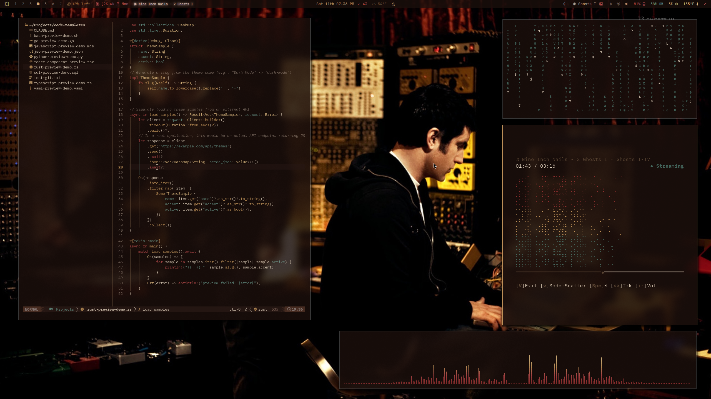
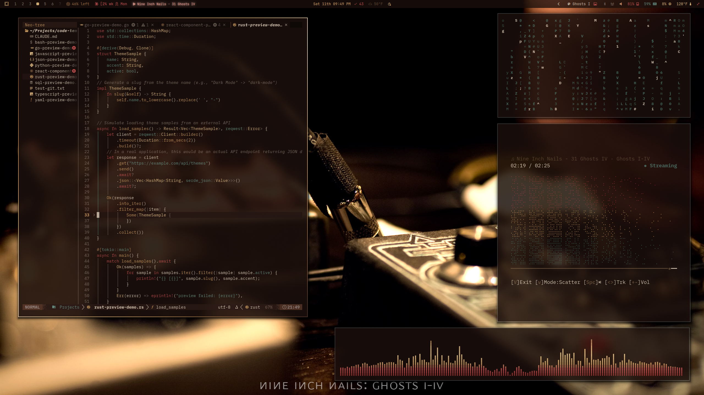
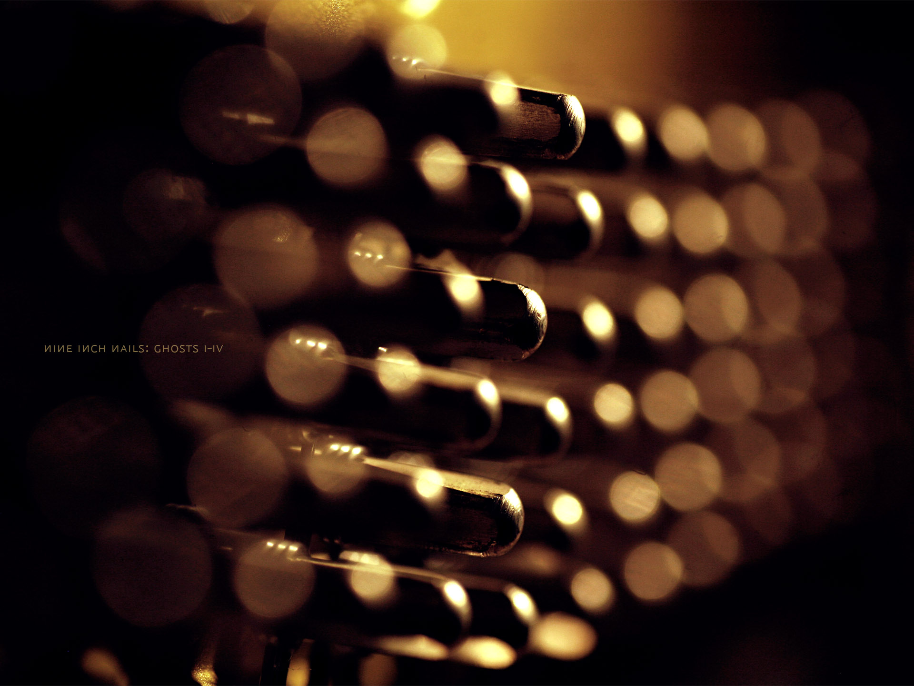
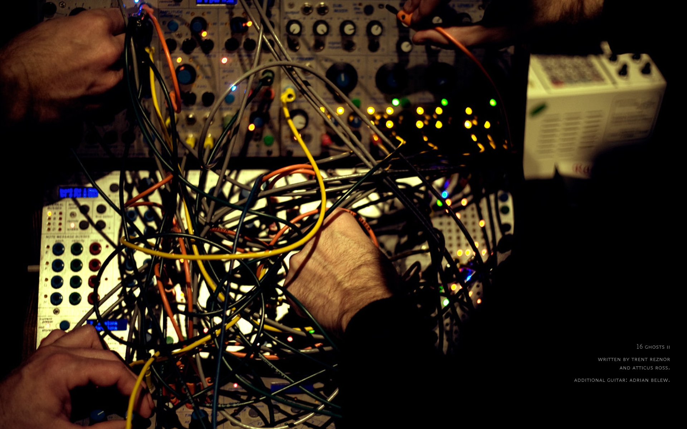
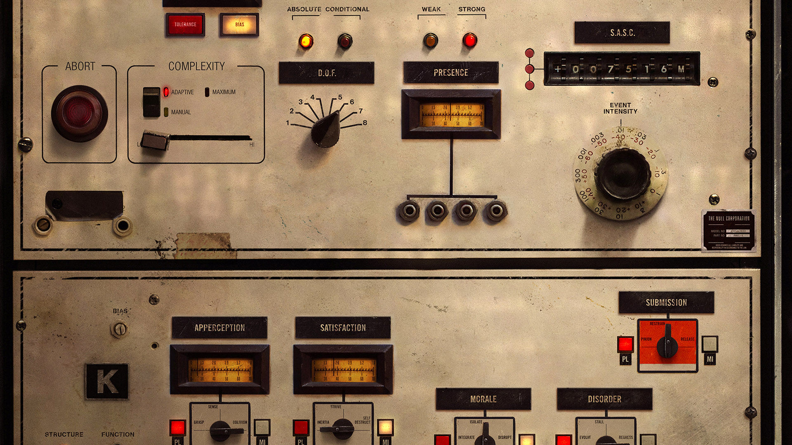

# Omarchy Ghosts I Theme

Ghosts I is a dark Omarchy theme pulled from a cropped portion of the *Ghosts I-IV* album art: tobacco brown, worn brass, dried blood, smoked glass, and a muted green that feels more like oxidized hardware than neon. It lands somewhere between machine oil, hot dust, and the amber glow of old rack gear after midnight.

## Preview





## Install

Use the Omarchy theme installer:

```bash
omarchy-theme-install https://github.com/OldJobobo/omarchy-ghosts-i-theme.git
```

## What's Included

- A standalone Neovim colorscheme in `colors/ghosts-i.lua`
- A custom `vencord.theme.css` for Discord
- A dedicated `steam.css` override to carry the palette into Steam
- Theme coverage for Hyprland, Hyprlock, Walker, Mako, SwayOSD, GTK, terminals, Warp, btop, Chromium, and shell color exports

## Wallpapers

<table>
  <tr>
    <td><br>Signal Lights</td>
    <td><br>Patch Pins</td>
    <td><br>Table Circuit</td>
    <td><br>Green Tube</td>
  </tr>
  <tr>
    <td><br>Cable Nest</td>
    <td><br>Red Distortion</td>
    <td><br>Studio Rack</td>
    <td><br>Machine Panel</td>
  </tr>
</table>

## Requirements

- `Yaru-yellow` icon theme for the intended icon treatment

## Notes

- The repo ships both `preview.png` and an additional desktop screenshot for the current theme state.
- VS Code marketplace metadata is included in `vscode.json` for the matching extension package: `oldjobobo.ghosts-i-theme`.

## Attribution

- Theme direction is based on a portion of the *Ghosts I-IV* album art by Nine Inch Nails.
